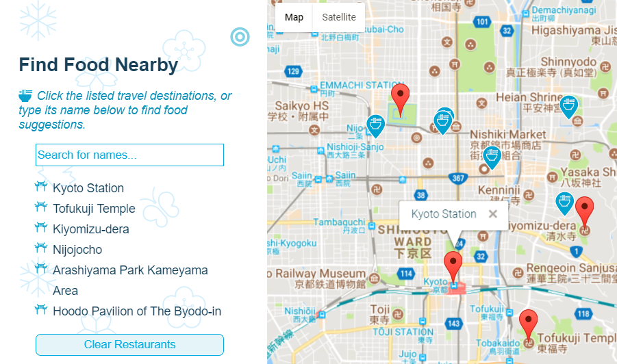

# Map

This is one of my Front-and-End assignment @**Udacity**.

_Google Map API_, _Knockout_ and _JavaScript_ were used in this project.

There are some points of interests set on the map and in the list.

When the marker of a point is clicked, the food suggestions near that point will be shown on the map.

The food suggestions are automatically retrieved from _Yelp_ by its API.

